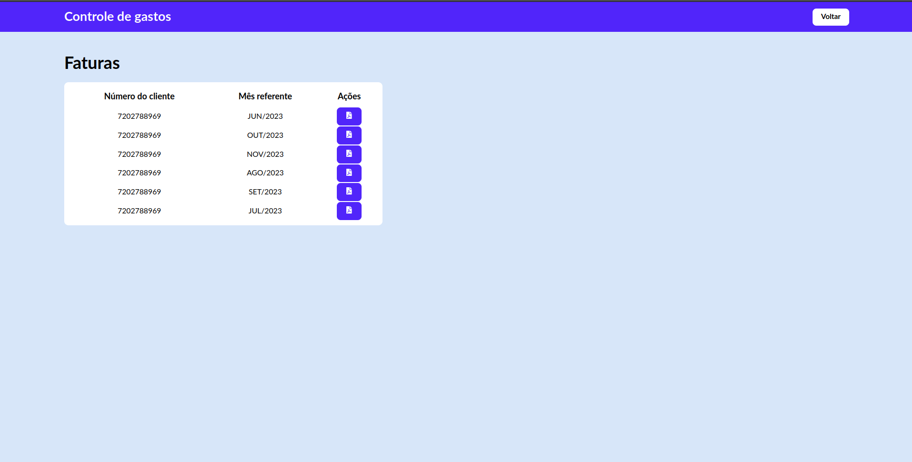

# Projeto controle de gasto


O projeto é composto de 3 aplicações: Faturas, Scraper-lumi (API) e Scraper-lumi-app (Aplicação com vite e React).

# Utilizando o scrapper 

1. É necessário o uso do docker para a criação da imagem 
    `docker build -t script-faturas .`
2. O container será executado para a serialização do dado no formato JSON
    `docker run  script-faturas > data.json`


# Utilizando a API - Primeiros passos

1. Com o scrapper realizado e com um novo JSON pronto resta agora gerar os **seeds** que irão para o **banco de dados**.


2. O **data.json** deverá ficar dentro da pasta _/prisma_ para que o script de tenha efeito.
3. ```sh create-postgres.sh``` para subir o **container** da api.
4. `npx prisma migrate dev` para aplicar as migrações
5. `npx prisma db seed` para preencher a base com os dados presentes no `data.json`
6. A aplicação utiliza **nest** para servir os dados, rode o `npm run start:dev` 

# Utilizando o APP 
1. O app utiliza o vite e React, para utilizá-lo basta digitar o comando com a API ativa: `npm run dev`

2. A tela inicial informará que nada foi encontrado é necessário que você busque por um id de cliente válido, por sorte temos uma rota para teste.


3. Utilizando o endpoint `http://localhost:3000/invoices` e escolhemos um id


4. Bingo! Agora temos um id e vamos pesquisar


5. Acessamos a biblioteca de fatura clicando em **faturas**
